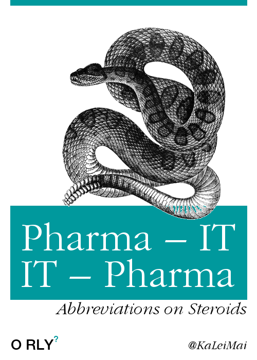

#HSLIDE

## Data Inte`git`ry for the Pharmaceutical Industry

#### Git Merge 2017 Brussels 

#### Katrin Leinweber ([@KaLeiMai](https://twitter.com/kaleimai/))

###### CC-BY-4.0 

#HSLIDE?image=img/data-integrity-trends.png

#HSLIDE

### Data integrity nightmares

> Failure to prevent unauthorized access or changes to data [[…]](http://www.fda.gov/iceci/enforcementactions/warningletters/2016/ucm501282.htm)

> additional testing was performed but not properly documented [[…]](www.fda.gov/iceci/enforcementactions/warningletters/2014/ucm401451.htm)

> raw data files in the recycle bin […] even in the presence of 'Do Not Delete Any Data' notes [[…]](http://www.fda.gov/iceci/enforcementactions/warningletters/ucm455345.htm)

-– [Warning letters](http://google2.fda.gov/search?as_sitesearch=www.fda.gov/iceci/enforcementactions/warningletters&q=%22data+integrity%22+inmeta:search_topic%3DWarning%2520Letters&client=FDAgov&output=xml_no_dtd&proxystylesheet=FDAgov&site=FDAgov&getfields=*&requiredfields=-archive:Yes&partialfields=&filter=1&dnavs=inmeta:search_topic%3DWarning%2520Letters&sort=date:D:S:d1) from the U.S. Food & Drug Administration to companies.

#HSLIDE

### Solution

Change control and audit trails for everything (work instructions, raw measurement data, analytical methods, etc.)

> […] secure, computer-generated, time-stamped electronic record that allows for reconstruction of the course of events relating to the creation, modification, or deletion […] 

> […] chronology of the “who, what, when, and why” 

–- [FDA "Data Integrity…" draft guidance](http://www.fda.gov/downloads/drugs/guidancecomplianceregulatoryinformation/guidances/ucm495891.pdf)

#HSLIDE

## Pharma-specific software can do this…

#### Sometimes…  <!-- .element: class="fragment" -->

###### Kinda…  <!-- .element: class="fragment" -->

## Problems: few users, no or little agility, abysmal UX <!-- .element: class="fragment" -->

#HSLIDE

### Regulatory requirements mapped to Git's features 

- *A*ttributable => commit author
- *L*egible => content-agnostic, both human- & machine readable, right?  <!-- .element: class="fragment" -->
- *C*ontemporaneously recorded => same as on paper, but prompts & automation possible <!-- .element: class="fragment" -->
- *O*riginal or true copy => digital & hashed <!-- .element: class="fragment" -->
- *A*ccurate => down to line & character <!-- .element: class="fragment" -->

- **plus:** complete, consistent, enduring & available  <!-- .element: class="fragment" -->

-- World Health Organisation: [Guidance on good data and record management practices](http://www.who.int/medicines/publications/pharmprep/WHO_TRS_996_annex05.pdf)

#HSLIDE

### Brainstorming hurdles to Git adoption in pharma

- history-altering functions (`amend`, `filter-branch`…), or alerts  <!-- .element: class="fragment" -->
- file meta-data not staged & committed alongside content <!-- .element: class="fragment" -->
- compile for embedded systems

#HSLIDE

### Brainstorming killer applications for Git in pharma

- best-in-class audit trail addons/plugins for existing software
- enable regulatory verification with anonymous attestation (0-knowledge proof + blind signature)[^aa], "hash-only remotes/mirrors", etc. <!-- .element: class="fragment" -->
- visual hook/automation/workflow designer (BPML)

[^aa]: Technologien für und wider Digitale Souveränität (33c3)

#HSLIDE

- API = Active Pharmaceutical Ingredient  <!-- .element: class="fragment" -->
- CSV = Computer Systems Validation  <!-- .element: class="fragment" -->
- GMP = Good Manufacturing Practice  <!-- .element: class="fragment" -->

#HSLIDE

# Thanks for your attention!
